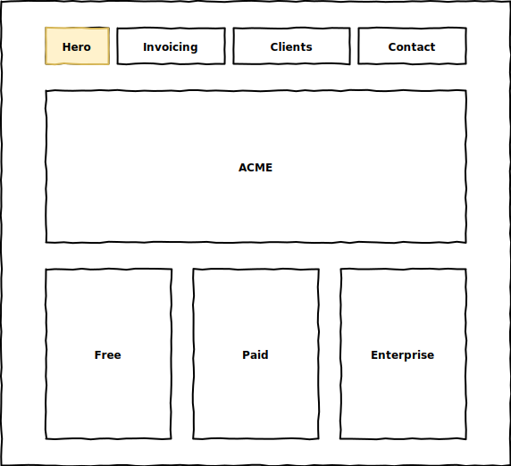
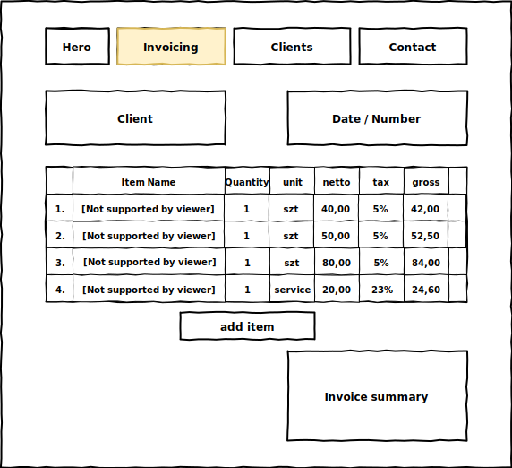

# Wsei Invoicing App Reference

Projekt referencyjny w ramach przedmiotu ``Projektowanie Aplikacji Webowych`` Wysza szkoła ekonomii i informatyki w Krakowie

## praca z projektem

```
    #konkretny test
    ng test --main ./src/app/invoicing/model/price-calculation/price-calculator.spec.ts
    
    #wszystkie testy
    ng test
```


# Mockup
## hero page


## invoicing page



# tagi
* ex1 - inicjalizacja projektu
* ex2 - routing hero / invoicing
* ex3 - lista pozycji
* ex4 - wyliczanie wartości pozycji
* ex5 - automatyczne odświeanie po przeliczeniu
* ex6 - list produktów katalog
* ex7 - query extenral api for items
* ex8 - Invoice summary